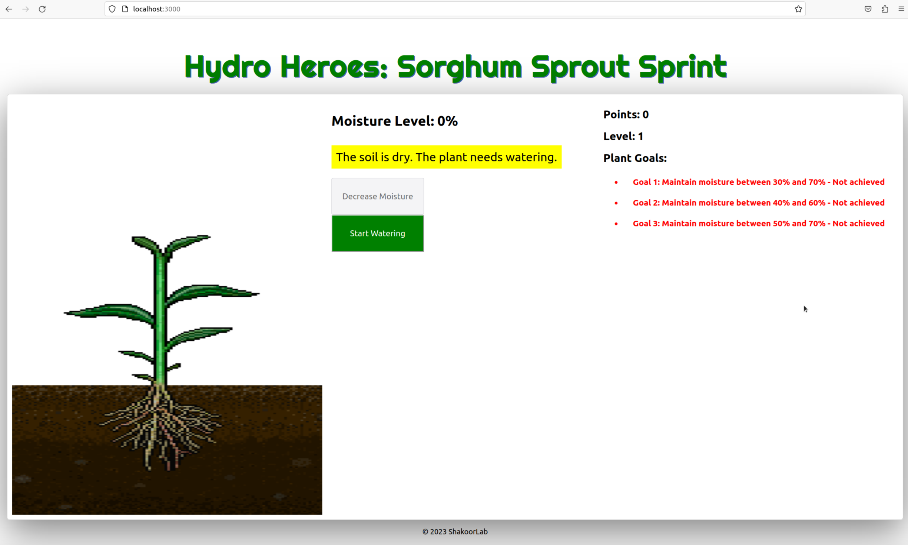

# A Real-time Gaming Framework for IoT and Smart Agriculture Teaching

## Description

The Real-time Gaming Framework for IoT and Smart Agriculture is an educational project that introduces the concepts of IoT, sensor integration, MQTT protocol, and real-time data visualization through an interactive game. This README provides an overview of the framework's components and how to get started. Helps in learning-->

1. IoT Framework: facilitates the connection of sensor and actuator devices, forming the Internet of Agricultural Things (IoAT).
2. IoT board: a tutorial on how to connect sensors (e.g., soil moisture sensors) and actuators (e.g., water pumps) using Arduino devices.
3. MQTT protocol: significance and implementation of the MQTT protocol, a widely utilized data exchange protocol within the IoT domain.
4. Realtime data-based Plant growth visualization: explore the visualization of plant growth using real-time data.
5. Interface for soil moisture level control - automatic/manual: an interface that allows for the automatic or manual control of soil moisture levels.
6. Reward-based gaming control interface for plant care: a unique interface that incorporates rewards and gaming elements to enhance user engagement in the process of plant care.



## Table of Contents

- [Getting Started](#getting-started)
  - [IoT Board Tutorial](#iot-board-tutorial)
  - [MQTT Protocol](#mqtt-protocol)
  - [Realtime Data Visualization](#realtime-data-visualization)
- [Gameplay](#gameplay)
  - [Soil Moisture Level Control](#soil-moisture-level-control)
  - [Reward-Based Gaming Control](#reward-based-gaming-control)
- [Usage](#usage)
  - [Clone the Repository](#clone-the-repository)
- [About the Gaming Framework](#about-the-gaming-framework)
- [Implementation Details](#implementation-details)
  - [Arduino Setup](#arduino-setup)
  - [Mosquitto Broker Installation](#mosquitto-broker-installation)
    - [Configure Mosquitto for Websockets](#configure-mosquitto-for-websockets)
  - [Python Setup](#python-setup)
  - [Start the React App](#start-the-react-app)
- [Enjoy the Game](#enjoy-the-game)

## Getting Started

### IoT Board Tutorial

Learn how to connect sensors (e.g., soil moisture) and actuators (e.g., water pump) using an Arduino device. Follow the provided tutorial to understand the hardware setup. Coming soon...

### MQTT Protocol

Explore the MQTT protocol, a widely used data protocol for IoT. Understand its use and implementation in establishing communication between devices. Coming soon...

### Realtime Data Visualization

Learn how to visualize real-time data from sensors. This part of the framework will help you grasp the concept of visualizing data for better understanding.

## Gameplay

1. Moisture Level Monitoring: The game keeps track of how much water the plant has. It shows this on the screen, so players know when the plant needs water.
2. Watering the Plant: Players can water the plant by clicking a button. If the plant needs water (moisture level below 70), players earn points. If not, they lose points.
3. Game Goals: The game sets goals for the player. These goals are about keeping the plant's moisture level within specific ranges. When players achieve a goal, they earn points and move to a higher level.
4. Points and Level: Players can see their earned points and current level on the screen. Points increase as they achieve goals.
5. Restarting the Game: If players want to play again, they can restart the game by clicking a button. This refreshes the game.

## Game Flow
1. The game starts by showing a plant and its moisture level.
2. Players can water the plant and see their points increase.
3. The game has goals related to moisture levels. Achieving these goals gives players more points and moves them up a level.
4. If players want to play again, they can restart the game.

## Usage

### Clone the Repository

To use this framework, clone the repository to your local machine. This will provide you with all the necessary code and resources to set up the game and explore its components.

```bash
git clone https://github.com/Shakoor-Lab-Organization/learn_ioat.git
```

## About the Gaming Framework

The gaming framework is designed to simulate the care of a virtual plant using React, a popular web development library. The game emphasizes monitoring the plant's moisture level and accomplishing goals to progress.

## Implementation Details

### Arduino Setup

1. Install Arduino IDE from https://www.arduino.cc/en/software.
2. Obtain a water pump, channel relay, and soil moisture sensor that are Arduino compatible.
3. Use Arduino IDE to upload the provided code (.ino file) to your Arduino device.

### Mosquitto Broker Installation

Install the Mosquitto broker with the following commands:

```bash
sudo apt-add-repository ppa:mosquitto-dev/mosquitto-ppa
sudo apt-get update
sudo apt-get install mosquitto
```

### Configure Mosquitto for Websockets

To enable websockets for the Mosquitto broker, follow these steps:

1. Open the Mosquitto configuration file using a text editor:

    ```bash
    sudo nano /etc/mosquitto/mosquitto.conf
    ```

2. Add the following lines to enable websockets:

    ```yaml
    listener 1883
    listener 8080
    protocol websockets
    ```

3. Save and close the file.

### Start Mosquitto Broker

Before running the game, you need to start the Mosquitto broker to enable MQTT communication:

1. Start the Mosquitto broker with the provided configuration:

    ```bash
    mosquitto -c /etc/mosquitto/mosquitto.conf
    ```


### Python Setup

Before running the game, ensure you have the necessary Python packages installed:

1. Install Python packages for MQTT and serial connectivity:

    ```bash
    pip install paho-mqtt
    pip install pyserial
    ```

2. Start MQTT client and serial connectivity:

    ```bash
    cd learn_ioat
    cd serial_mqtt
    sudo python serial_pub.py
    ```

### Start the React App

To launch the game's interface, follow these steps:

1. Navigate to the React app directory:

    ```bash
    cd learn_ioat
    npm start
    ```

2. Enjoy the game!

### Enjoy the Game

Congratulations! You have set up the Real-time Gaming Framework for IoT and Smart Agriculture. Explore the different components, learn about IoT concepts, and have fun taking care of your virtual plant. This framework is a great way to learn about IoT in an interactive and engaging manner. Happy learning!

